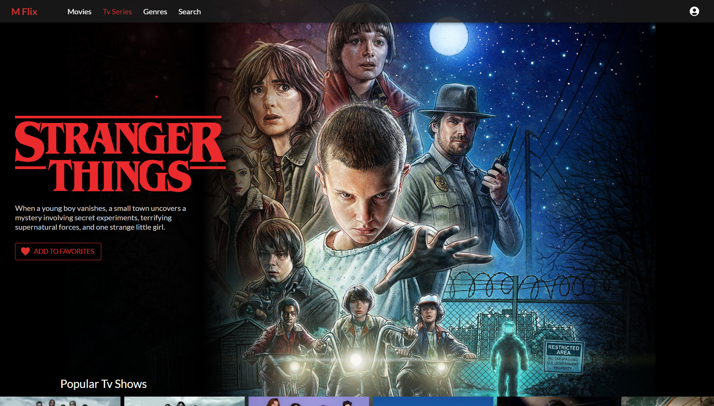
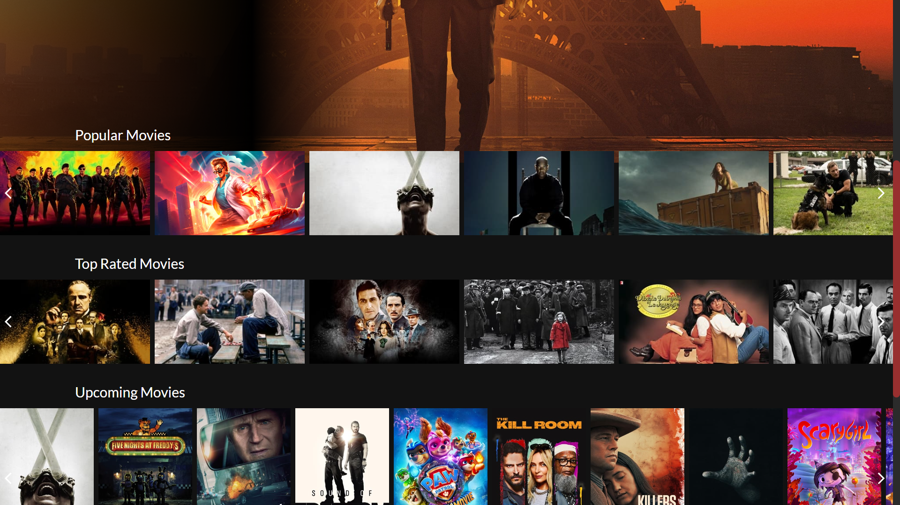
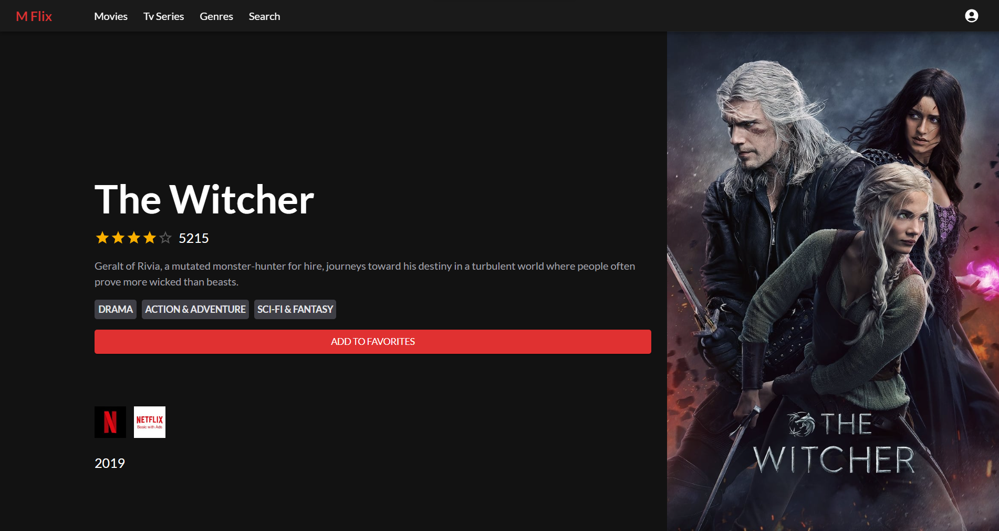
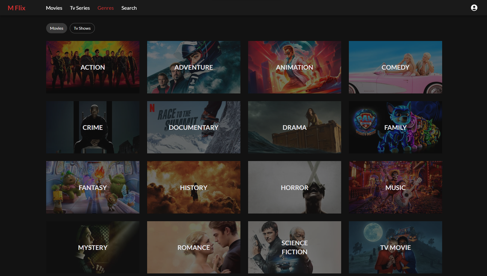
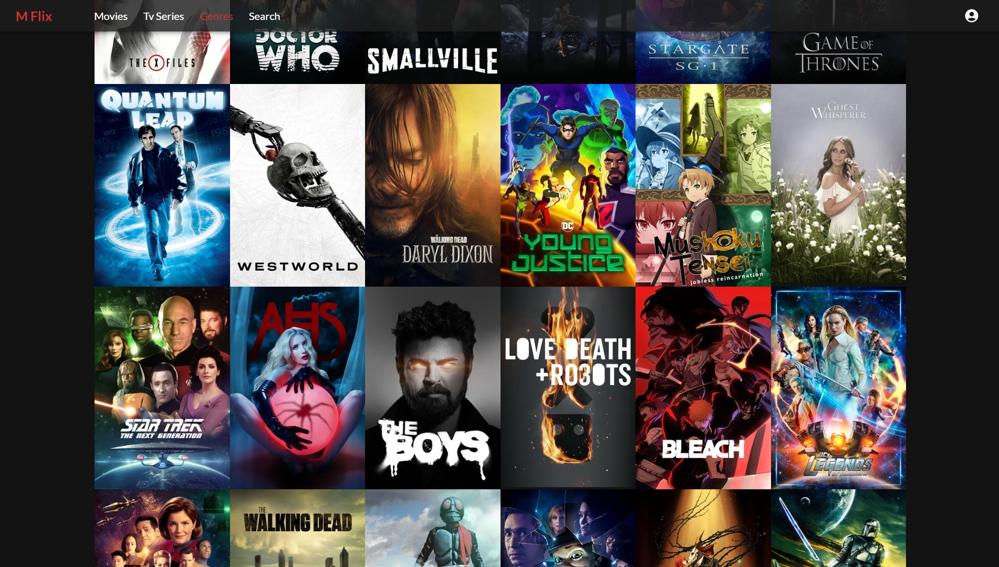
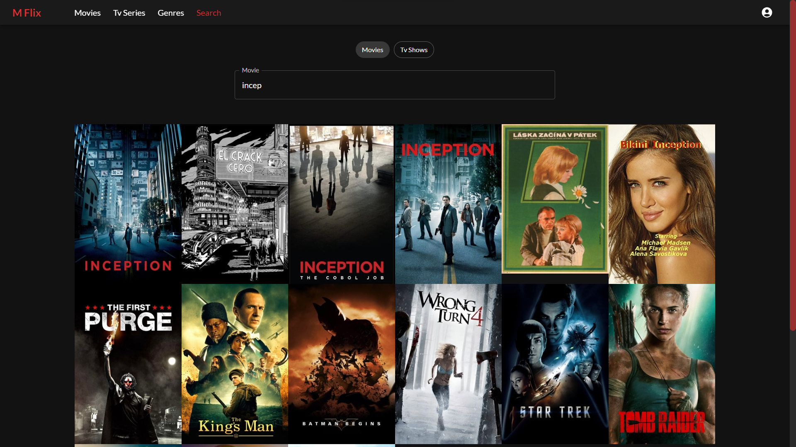

# Movies-App

**Movies App** is a web application built with React, Material-UI, and Redux Toolkit, designed to help users discover, explore, and enjoy their favorite movies and TV shows. This project harnesses the power of the TMDB (The Movie Database) API to provide an extensive and up-to-date collection of movie and TV show information.

## Preview

## Tech Stack

| Technology    | Description                                     |
|---------------|-------------------------------------------------|
| Material-UI   | A popular React UI framework that provides a set of reusable components and styles for building modern web applications. |
| Redux Toolkit | A library that simplifies state management in React applications by providing a predictable and efficient state container. |
| React         | A JavaScript library for building user interfaces, commonly used in single-page web applications. |
| Node.js       | A runtime environment that allows you to execute JavaScript code on the server-side, often used in backend development. |
| Express       | A minimal and flexible Node.js web application framework for building web applications and APIs. |
| Tailwind CSS  | A utility-first CSS framework that streamlines the design and styling of web applications by providing a set of pre-defined classes. |
| TypeScript    | A statically typed superset of JavaScript that enhances code quality and maintainability in large-scale applications. |
| React Router  | A routing library for React applications, enabling navigation and URL handling for single-page applications. |

## Powered By

